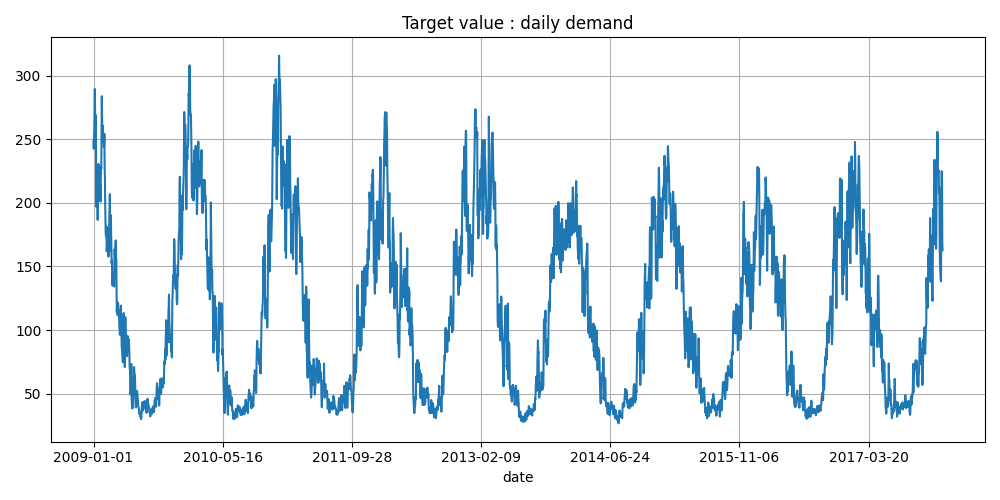
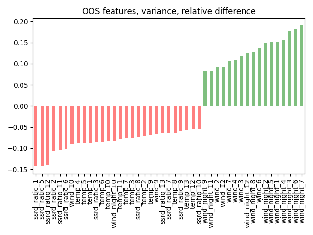
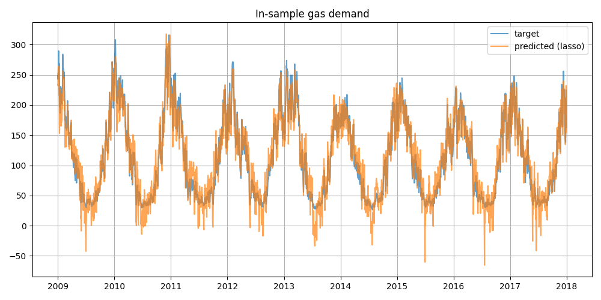
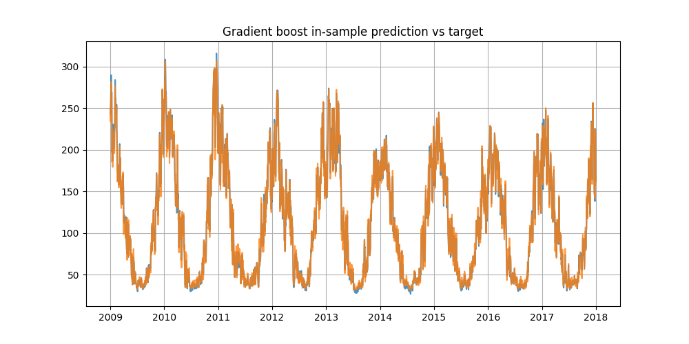

# Quantitative modelling task to predict domestic gas demand

The task is to perform a regression on a time-series
with a daily frequency.

In-sample target `demand` :

The out-of-sample distribution 
which contains features for exactly a whole year,
seemingly has a different distribution than the in-sample 
empirical distribution, for instance for order 2 moments,
many have large discrepancies between in/out sample. 

## Metrics 

## Linear Regression benchmark

- 5-fold cross-validation 

## Gradient Boost Regressor prediction

- Non-linear feature engineering
- Feature importance analysis

## Gaussian Process model

- Kernel choice

