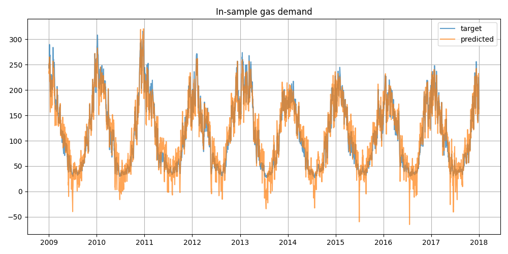

# Quantitative modelling task to predict domestic gas demand

The task is to perform a regression on a time-series
with a daily frequency.

In-sample target `demand` :


The out-of-sample distribution 
which contains features for exactly a whole year,
seemingly has a different distribution than the in-sample 
empirical distribution, for instance for order 2 moments,
many have large discrepancies between in/out sample. 


## Metrics 

**RMSE :**

```math
\text{RMSE} = \sqrt{\frac{1}{N} \sum_{i=1}{N} (x_i - \bar{x})^2}
```

**R2 :**

```math
\text{R}^2 = 1 - \frac{\text{RSS}}{\text{TSS}}
```

## Linear Regression benchmark

- 5-fold cross-validation 





The predicted demand is negative on many occurences :


## Gradient Boost Regressor prediction

- Non-linear feature engineering
- Feature importance analysis


## Gaussian Process model

### Kernel Design

The GP model uses a composite kernel to capture seasonality, trends, and noise:

```math
k(x, x') = k_{\text{seasonal}}(x, x') + k_{\text{trend}}(x, x') + k_{\text{noise}}(x, x')
```

**Seasonal component:** Product of RBF and periodic kernels for smooth yearly cycles
```math
k_{\text{seasonal}}(x, x') = \sigma_1^2 \cdot \exp\left(-\frac{\|x - x'\|^2}{2\ell_1^2}\right) \cdot \exp\left(-\frac{2\sin^2(\pi\|x - x'\|/T)}{2\ell_p^2}\right)
```
where T ≈ 1 year, ℓ₁ controls smoothness, ℓ_p controls period variation

**Trend component:** Long-term RBF for gradual variations
```math
k_{\text{trend}}(x, x') = \sigma_2^2 \cdot \exp\left(-\frac{\|x - x'\|^2}{2\ell_2^2}\right)
```
where ℓ₂ = 10.0 captures long-term patterns

**Noise component:** White kernel for measurement uncertainty
```math
k_{\text{noise}}(x, x') = \sigma_n^2 \cdot \delta(x, x')
```
where σ_n² ∈ [1e-5, 1e1] optimized during training

### Results

In-sample prediction comparison with the true demand :


The out-of-sample prediction seems reliably following the seasonality :


With reasonable confidence intervals :


