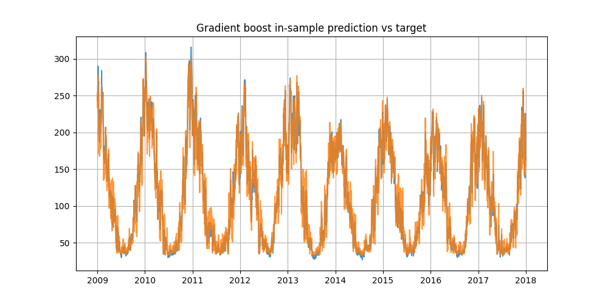

# Quantitative modelling task to predict domestic gas demand

The task is to perform a regression on a time-series (daily domestic gas demand in the UK)
from aggregated humidity and temperature data.
The training set spans 2009 to the end of 2019, 
with no missing values or erroneous data types.

There are 63 features related to wind, sun and temperature :

| Name | Description |
| ---- | ----------- | 
| temp | Day aggregated temperature |
| temp_night | Overnight aggregated temperature | 
| wind | Aggregated wind metric |
| wind_night | Overnight wind metric | 
| SSRD | Surface Solar Radiation Downward | 

*SSRD : mean radiative power in a certain wavelength interval per suface unit*

The in-sample target `demand` shows strong periodic patterns :


The out-of-sample distribution 
contains daily data for exactly two years
with no missing values either.

## Metrics 

Classical regression metrics are used,
without knowledge of the actual objective metric,
and without domain-specific requirement with the current regression problem.

**RMSE :**

```math
\text{RMSE} = \sqrt{\frac{1}{N} \sum_{i=1}^{N} (x_i - \bar{x})^2}
```

**R2 :**

```math
\text{R}^2 = 1 - \frac{\text{RSS}}{\text{TSS}}
```

## Outline

Given the small amount of training data, 
deep-learning methods risk ovrefitting.
Moreover, given the clear periodicity,
it seems relevant to incorporate that information in the choice of model design.

To confirm the relevance of the periodicity design,
benchmark models are first tested :

1. [Linear regression with period-specific biases](#linear-regression-benchmark)
2. [Gradient boost regression tree](#gradient-boost-regressor-prediction)

Then, the model that has been retained to incorporate the periodicity of the data is a Gaussian process :

3. [Gaussian process regressor](#gaussian-process-model)

where the choice of kernel is paramount to learning the periodicity correctly.

## Models 

### Linear Regression benchmark

- 5-fold cross-validation applied to tune regularisation parameter.
- Feature engineer : 
    - log kelvin temperature (15 % improvement in-sample RMSE)
    - seasonal (quarterly) level (15% extra improvement in-sample RMSE) 

*In-sample prediction :*


*OOS prediction :*


> [!WARNING]
> The predicted demand is negative on many occurences.

The linear regression, while regularised, seems to have 
**too much variance and is sensitive to outliers**.

The in-sample RMSE is approximately 12.

A feature importance analysis after standardising the input data shows 
temperature data is by far the most correlated to the domestic gas demand :


where the absolute coefficient values have been averaged by category 
(including log temperature, day and night not distinguished).

### Gradient Boost Regressor prediction

- Feature importance analysis




### Gaussian Process model

#### Kernel Design

Composite kernel to capture seasonality, trends, and noise:

```math
k(x, x') = k_{\text{seasonal}}(x, x') + k_{\text{trend}}(x, x') + k_{\text{noise}}(x, x')
```

**Seasonal component:** Product of RBF and periodic kernels for smooth yearly cycles
```math
k_{\text{seasonal}}(x, x') = \sigma_1^2 \cdot \exp\left(-\frac{\|x - x'\|^2}{2\ell_1^2}\right) \cdot \exp\left(-\frac{2\sin^2(\pi\|x - x'\|/T)}{2\ell_p^2}\right)
```
where T ≈ 1 year, ℓ₁ controls smoothness, ℓ_p controls period variation

**Trend component:** Long-term RBF for gradual variations
```math
k_{\text{trend}}(x, x') = \sigma_2^2 \cdot \exp\left(-\frac{\|x - x'\|^2}{2\ell_2^2}\right)
```
where ℓ₂ = 10.0 captures long-term patterns

**Noise component:** White kernel for measurement uncertainty
```math
k_{\text{noise}}(x, x') = \sigma_n^2 \cdot \delta(x, x')
```
where σ_n² ∈ [1e-5, 1e1] optimized during training

#### Results

In-sample prediction comparison with the true demand :


The out-of-sample prediction seems reliably following the seasonality :


With reasonable confidence intervals :


## Discussion 

**Feature engineering**

**Incorporating external data**
Gas and electricity prices
Major events affecting gas supply in Europe like the invasion of Crimea in 2014, major anouncements about NordStream.

